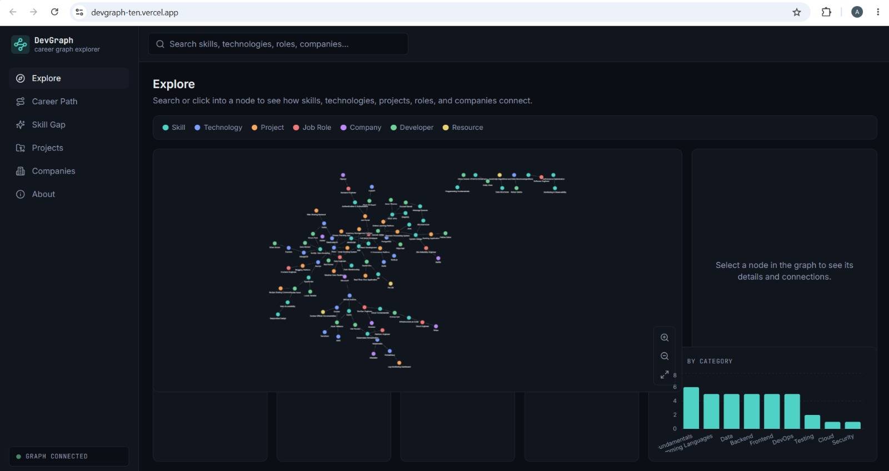
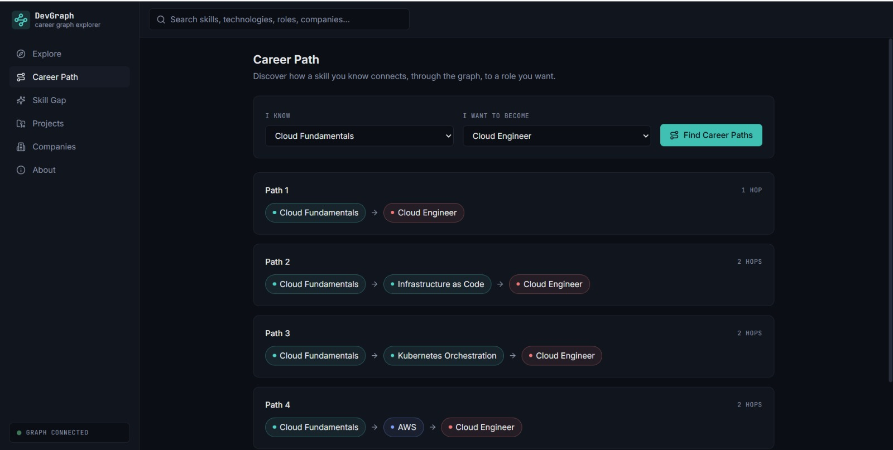
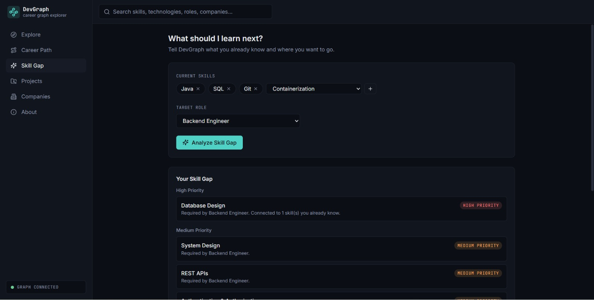
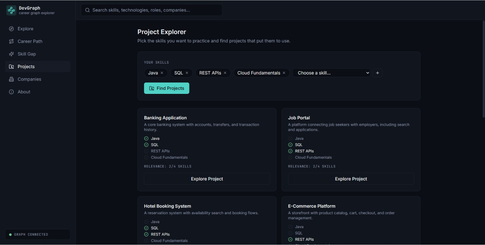
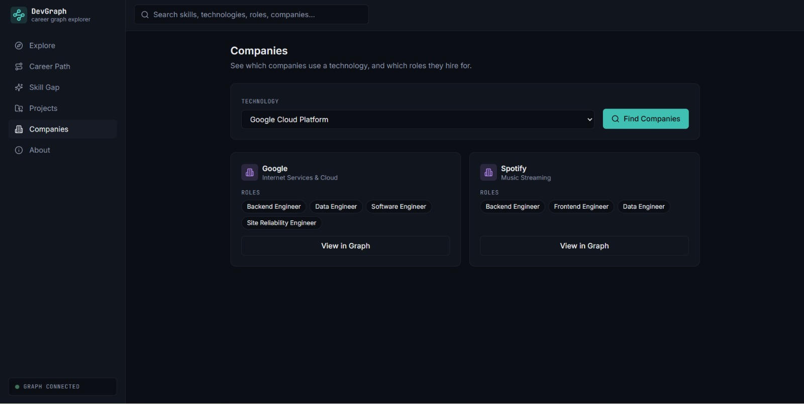
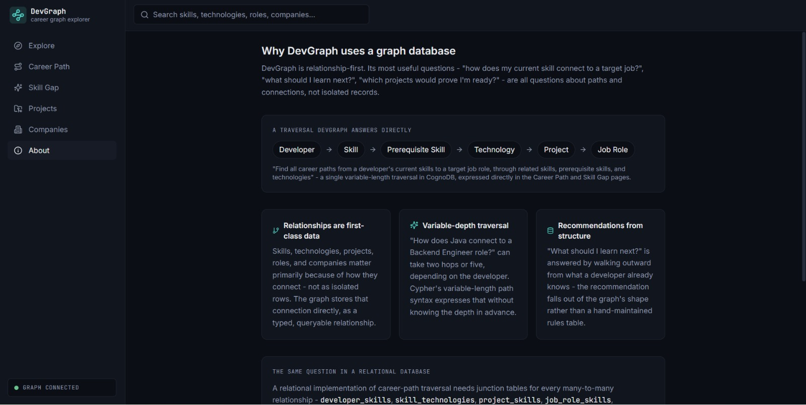
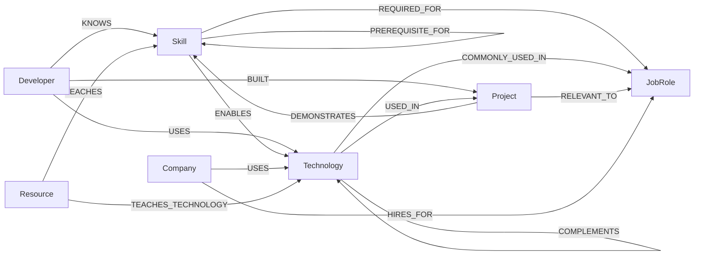

# DevGraph

**Explore the connections between skills, technologies, projects, companies and careers.**

DevGraph is a graph-powered developer skill and career relationship explorer, backed by **CognoDB** - a managed graph database that speaks openCypher over Bolt and is compatible with the official Neo4j drivers.

---

## Overview

DevGraph lets a non-technical user explore how **Developers, Skills, Technologies, Projects, Job Roles, Companies,** and **Learning Resources** connect to one another - and then puts those connections to work:

- Discover multi-hop **career paths** from a skill you know to a role you want.
- Run a **skill gap analysis** against a target role, with prerequisite-aware prioritization.
- Find **projects** that demonstrate a chosen set of skills.
- Find **companies** hiring for roles that use a given technology.
- Visually **explore the graph** itself, node by node.

The application is intentionally *not* a CRUD dashboard. Every primary feature is a traversal question - "how does A connect to B?" - that only makes sense because the data is a graph.

## Demo

- **Live App:** [DevGraph](https://devgraph-ten.vercel.app)
  https://devgraph-ten.vercel.app

- **Screen Recording:** [Watch Demo](https://drive.google.com/file/d/1b2NJsq_N6-2dHPWhgLSBdOUGTtOHYQtT/view?usp=drive_link)
  https://drive.google.com/file/d/1b2NJsq_N6-2dHPWhgLSBdOUGTtOHYQtT/view?usp=drive_link

## Screenshots

Screenshots live in [`docs/screenshots/`](./docs/screenshots).

### 1. Dashboard / Graph Explorer



### 2. Career Path



### 3. Skill Gap Analyzer



### 4. Project Explorer



### 5. Company Explorer



### 6. About / Why Graph



## Features

- Global entity search across all seven node types, grouped by type.
- Interactive Cytoscape.js graph with type-colored nodes, a legend, zoom/pan/fit, and click-to-expand neighbor exploration.
- Multi-hop **Career Path** discovery between a skill and a job role (up to 4 hops).
- **Skill Gap Analyzer** that ranks missing skills as High/Medium priority based on how directly they connect to what you already know, plus foundational prerequisite gaps.
- **Project Explorer** that ranks projects by how many of your chosen skills they demonstrate.
- **Company Explorer** that finds companies using a technology and the roles they hire for.
- Live dashboard statistics (entity/relationship counts, skills-by-category chart).
- Graceful loading, empty, and error states throughout - including a dedicated "database offline" state that never crashes the app.
- Fully responsive: sidebar becomes a drawer, detail panels stack, on mobile/tablet.

## Why a Graph Database?

DevGraph is relationship-first. Its most useful questions aren't "show me a record" - they're "how does this connect to that?":

- **Relationships are first-class data.** Skills, technologies, projects, roles, and companies matter primarily because of how they connect. The graph stores that connection directly as a typed, queryable relationship, not as a foreign key buried in a junction table.
- **Variable-depth traversal.** "How does Java connect to a Backend Engineer role?" might take two hops or five, depending on the developer and the path chosen. Cypher's variable-length path syntax (`-[:RELATED_TO|PREREQUISITE_FOR*1..4]->`) expresses that without knowing the depth ahead of time.
- **Recommendations fall out of structure.** "What should I learn next?" is answered by walking outward from a developer's known skills toward a role's required skills - the recommendation is a query, not a hand-maintained rules table.
- **This is not a claim that graphs are always faster.** A relational database can absolutely answer these questions too. The claim is narrower: for an app whose core product *is* relationship traversal, the graph model is more natural to write and easier to evolve as new relationship types are added. See [Relational Database Comparison](#relational-database-comparison) below for the concrete version of this argument.

## Architecture

```text
                     ┌──────────────────────┐
                     │        User           │
                     └──────────┬────────────┘
                                │
                                ▼
                     ┌──────────────────────┐
                     │ React + Vite Client    │
                     │ (Cytoscape.js graph)   │
                     └──────────┬────────────┘
                                │ HTTPS (REST/JSON)
                                ▼
                     ┌──────────────────────┐
                     │ Node.js + Express API  │
                     │ (official Neo4j driver)│
                     └──────────┬────────────┘
                                │ Bolt (openCypher)
                                ▼
                     ┌──────────────────────┐
                     │     CognoDB Cloud      │
                     │    Graph Database       │
                     └──────────────────────┘
```

The backend never uses a custom CognoDB SDK - it talks to CognoDB purely over Bolt via `neo4j-driver`, the same official driver used for Neo4j itself. One `Driver` instance is created at startup and reused for the process lifetime; every request opens a short-lived `Session` from that driver and closes it when done (see `server/src/db/`).

## Data Model

| Node | Key Properties |
|---|---|
| `Developer` | id, name, experienceLevel, location, bio |
| `Skill` | id, name, category, difficulty, description |
| `Technology` | id, name, category, description |
| `Project` | id, name, description, difficulty, githubUrl |
| `JobRole` | id, title, level, description, salaryRange |
| `Company` | id, name, industry, location, description |
| `Resource` | id, title, type, url, description |

| Relationship | Meaning |
|---|---|
| `(Developer)-[:KNOWS]->(Skill)` | A developer's known skills |
| `(Developer)-[:USES]->(Technology)` | A developer's working technologies |
| `(Developer)-[:BUILT]->(Project)` | Projects a developer has built |
| `(Skill)-[:RELATED_TO]->(Skill)` | Conceptually related skills |
| `(Skill)-[:PREREQUISITE_FOR]->(Skill)` | Learning-order dependency |
| `(Skill)-[:ENABLES]->(Technology)` | A skill that unlocks a technology |
| `(Technology)-[:USED_IN]->(Project)` | Technologies used by a project |
| `(Technology)-[:COMPLEMENTS]->(Technology)` | Technologies commonly paired |
| `(Skill)-[:REQUIRED_FOR]->(JobRole)` | Skills a role requires |
| `(Technology)-[:COMMONLY_USED_IN]->(JobRole)` | Technologies typical of a role |
| `(Project)-[:DEMONSTRATES]->(Skill)` | Skills a project proves |
| `(Project)-[:RELEVANT_TO]->(JobRole)` | Roles a project is good practice for |
| `(Company)-[:HIRES_FOR]->(JobRole)` | Roles a company hires for |
| `(Company)-[:USES]->(Technology)` | Technologies a company uses |
| `(Resource)-[:TEACHES]->(Skill)` | What a learning resource teaches |
| `(Resource)-[:TEACHES_TECHNOLOGY]->(Technology)` | Technology-specific resources |

## Graph Diagram



## Example Queries

All Cypher lives in [`server/queries/`](./server/queries), grouped by feature, and every runtime value is passed as a bound parameter - never string-concatenated into the query text (see [`server/queries/graph.cypher.ts`](./server/queries/graph.cypher.ts) for the two narrow, documented exceptions where a *validated, hardcoded* label or integer is interpolated because Cypher itself doesn't allow parameterizing labels or variable-length path bounds).

**Node search** (`server/queries/search.cypher.ts`):

```cypher
MATCH (n)
WHERE (n.name IS NOT NULL AND toLower(n.name) CONTAINS toLower($search))
   OR (n.title IS NOT NULL AND toLower(n.title) CONTAINS toLower($search))
RETURN labels(n) AS labels, elementId(n) AS id, properties(n) AS props
LIMIT $limit
```

**Skill Gap Analysis** (`server/queries/career.cypher.ts`):

```cypher
MATCH (role:JobRole {title: $role})
MATCH (required:Skill)-[:REQUIRED_FOR]->(role)
WHERE NOT required.name IN $knownSkills
OPTIONAL MATCH bridge = (required)-[:PREREQUISITE_FOR|RELATED_TO*1..2]-(known:Skill)
WHERE known.name IN $knownSkills
WITH required, count(DISTINCT known) AS bridgeCount, min(length(bridge)) AS bridgeDistance
RETURN elementId(required) AS id, properties(required) AS props,
       bridgeCount, coalesce(bridgeDistance, -1) AS bridgeDistance
ORDER BY bridgeCount DESC, required.difficulty ASC
```

**Project Opportunities** (`server/queries/project.cypher.ts`):

```cypher
MATCH (p:Project)-[:DEMONSTRATES]->(s:Skill)
WHERE s.name IN $skills
WITH p, collect(DISTINCT s.name) AS matchedSkills
RETURN elementId(p) AS id, properties(p) AS props, matchedSkills,
       size(matchedSkills) AS matchCount
ORDER BY matchCount DESC
LIMIT $limit
```

**Companies by Technology** (`server/queries/company.cypher.ts`):

```cypher
MATCH (t:Technology {name: $technology})
MATCH (company:Company)-[:USES]->(t)
OPTIONAL MATCH (company)-[:HIRES_FOR]->(role:JobRole)
RETURN elementId(company) AS id, properties(company) AS props,
       collect(DISTINCT {id: elementId(role), title: role.title}) AS roles
ORDER BY company.name
```

## Multi-Hop Traversal

The **Career Path** feature (`server/queries/career.cypher.ts` → `CAREER_PATHS`) is the clearest example of multi-hop traversal in the app:

```cypher
MATCH (s:Skill {name: $skill})
MATCH (role:JobRole {title: $role})
MATCH path = (s)-[:RELATED_TO|PREREQUISITE_FOR|ENABLES|REQUIRED_FOR|COMMONLY_USED_IN*1..4]->(role)
WITH path, length(path) AS hops
ORDER BY hops ASC
LIMIT $limit
RETURN
  [n IN nodes(path) | {id: elementId(n), labels: labels(n), props: properties(n)}] AS nodes,
  [r IN relationships(path) | {id: elementId(r), type: type(r)}] AS relationships,
  hops
```

Given `Java → Backend Engineer`, this can return paths like:

```text
Java → Spring Boot → Backend Engineer
Java → REST APIs → Microservices → Backend Engineer
```

The **Skill Recommendation** query (`SKILL_RECOMMENDATIONS`) is the same idea run in the other direction: starting from a role's required skills, it walks backward through `PREREQUISITE_FOR`/`RELATED_TO` to find which of those required skills already connect to something the developer knows, which is what lets the UI explain *why* each recommendation makes sense.

## Relational Database Comparison

> "Find all career paths from a developer's current skills to a target job role, through related skills, prerequisite skills, and technologies."

A relational implementation of this single question needs, at minimum:

```text
developers, skills, developer_skills,
technologies, skill_technologies,
projects, project_skills,
job_roles, job_role_skills,
companies, company_technologies, ...
```

...plus a join across every one of those junction tables, and a *different* query for a 2-hop path than for a 5-hop path, because SQL has no native concept of "however many joins it takes." Every time a new relationship type is added (say, `Resource TEACHES Skill`), it's a new table and a new join to retrofit into every relevant query.

In CognoDB, the same relationships are stored directly as typed edges, and the traversal depth is a query parameter (`*1..4`) rather than a schema decision. see [`server/queries/career.cypher.ts`](./server/queries/career.cypher.ts) for the full implementation.

## Tech Stack

**Frontend:** React, TypeScript, Vite, Tailwind CSS, React Router, Lucide React, Recharts, Cytoscape.js
**Backend:** Node.js, TypeScript, Express.js, official `neo4j-driver`, Zod
**Database:** CognoDB Cloud (openCypher over Bolt)
**Deployment:** Vercel (frontend) + Render (backend) + CognoDB Cloud (database) - or any equivalent free-tier hosts

## Project Structure

```text
devgraph/
├── client/                  # React + TS + Vite frontend
│   └── src/
│       ├── api/              # Centralized API client (one module per feature)
│       ├── components/       # GraphView, Sidebar, NodeDetailsPanel, states, etc.
│       ├── pages/             # Explore, CareerPath, SkillGap, Projects, Companies, About
│       ├── hooks/              # useHealth, useDebouncedValue
│       ├── types/               # Shared frontend types
│       └── utils/                # Ontology color/icon config
│
├── server/                   # Node + Express + TypeScript backend
│   ├── src/
│   │   ├── config/env.ts       # Validated environment config
│   │   ├── db/                  # Reusable Neo4j driver + session helper
│   │   ├── routes/                # One router per resource
│   │   ├── controllers/            # Thin HTTP-layer glue
│   │   ├── services/                 # Business logic + Cypher execution
│   │   ├── middleware/                # Error handling, Zod validation
│   │   └── app.ts / server.ts           # Express app + entrypoint
│   ├── queries/                # All Cypher, grouped by feature
│   ├── scripts/
│   │   ├── data/                  # Seed data (skills, tech, projects, roles, ...)
│   │   └── seed.ts                  # Seed script entrypoint
│   └── tests/                   # Vitest unit tests (DB mocked)
│
├── docs/
│   ├── screenshots/
│   └── architecture/
│
├── .env.example
├── package.json              # Root convenience scripts
└── README.md
```

## CognoDB Setup

1. Visit CognoDB Cloud and create an account.
2. Create a free instance (typically labeled something like a `c0`/free tier).
3. Choose a region close to where you'll deploy the backend.
4. **Copy the generated password immediately** - most managed graph DB consoles only show it once.
5. Copy the Bolt connection URI (looks like `bolt+s://<instance-id>.databases.cognodb.cloud`).
6. Put both into `server/.env` (see [Environment Variables](#environment-variables)).
7. Run the seed script (see [Seeding the Database](#seeding-the-database)).
8. Start the application.

Never commit real credentials - `.env` is git-ignored at every level of this repo.

## Environment Variables

**`server/.env`** (copy from `server/.env.example`):

```env
PORT=5000
NODE_ENV=development

COGNODB_URI=bolt+s://your-instance-id.databases.cognodb.cloud
COGNODB_USERNAME=cognodb
COGNODB_PASSWORD=your-generated-password

CORS_ORIGIN=http://localhost:5173
```

**`client/.env`** (copy from `client/.env.example`):

```env
VITE_API_URL=http://localhost:5000
```

## Local Development

```bash
# from the repo root
npm run install:all   # installs root, client, and server dependencies

# copy env files and fill in your CognoDB credentials
cp server/.env.example server/.env
cp client/.env.example client/.env

npm run seed           # populate CognoDB with seed data
npm run dev             # runs client (5173) and server (5000) concurrently
```

## Seeding the Database

```bash
npm run seed
```

The seed script (`server/scripts/seed.ts`):

1. Connects to CognoDB and verifies connectivity.
2. Creates a uniqueness constraint on `id` for every node label (idempotent - safe to re-run).
3. Clears only DevGraph's own labeled nodes (`MATCH (n:Skill) DETACH DELETE n`, etc.) - never a blanket wipe of the whole database.
4. Creates all nodes in batches via `UNWIND`.
5. Creates every relationship type in batches via `UNWIND` + `MERGE`, printing a running count.
6. Prints a final summary and closes the driver.

Expected output:

```text
Connecting to CognoDB...
Connected successfully.

Creating constraints...
Clearing existing DevGraph seed data...

Creating skills...
  -> 35 skills created.
Creating technologies...
  -> 28 technologies created.
Creating projects...
  -> 18 projects created.
...

Creating relationships...
  -> 23 (:Skill)-[:RELATED_TO]->(:Skill) relationships created.
  ...

Seed completed successfully.

Nodes created: 176
Relationships created: 600+
```

The seed data is a curated, realistic dataset (developers, skills, technologies, projects, job roles, companies, and learning resources) rather than randomly generated - every relationship was chosen to make sense (see `server/scripts/data/relationships.ts`). It's intentionally sized to be interesting to explore rather than maximal; extend it by following the same pattern in `server/scripts/data/`.

## Running the Application

```bash
npm run dev
```

- Frontend: http://localhost:5173
- Backend: http://localhost:5000
- Health check: http://localhost:5000/api/health

## API Endpoints

| Method | Path | Description |
|---|---|---|
| GET | `/api/health` | DB connectivity status |
| GET | `/api/search?q=` | Global entity search |
| GET | `/api/nodes/:id` | Node by id, with degree |
| GET | `/api/nodes/:id/neighbors` | One-hop connections |
| GET | `/api/graph/explore?nodeId=&depth=&limit=` | Bounded graph exploration |
| GET | `/api/skills` \| `/technologies` \| `/job-roles` \| `/projects` \| `/companies` \| `/resources` | Typed listings |
| GET | `/api/career/path?skill=&role=` | Multi-hop career paths |
| POST | `/api/career/skill-gap` | `{ knownSkills, targetRole }` → ranked gaps |
| POST | `/api/career/recommendations` | `{ knownSkills, targetRole }` → next skills |
| POST | `/api/projects/recommend` | `{ skills }` → ranked project matches |
| GET | `/api/projects/:id` | Project detail |
| GET | `/api/companies/technology/:technology` | Companies using a technology |
| GET | `/api/companies/:id` | Company detail |
| GET | `/api/stats` | Dashboard statistics |

## Deployment

**Backend → Render (or any Node host):**

```env
COGNODB_URI=...
COGNODB_USERNAME=cognodb
COGNODB_PASSWORD=...
CORS_ORIGIN=https://your-frontend-url
```

Build command: `npm --prefix server install --include=dev && npm --prefix server run build` · Start command: `npm --prefix server start`

**Frontend → Vercel (or any static host):**

```env
VITE_API_URL=https://your-backend-url
```

Build command: `npm --prefix client run build` · Output directory: `client/dist`

Deploy the backend first, verify `GET /api/health` returns `{"status":"ok"}`, then deploy the frontend pointed at it. Never expose CognoDB credentials to the frontend - they only ever live in the backend's environment.

## Troubleshooting

| Symptom | Likely cause |
|---|---|
| `/api/health` returns 503 | CognoDB credentials wrong, instance paused, or network/firewall blocking Bolt (port 7687 equivalent over `bolt+s`) |
| Seed script exits with a missing-env error | `server/.env` wasn't created from `server/.env.example` |
| Frontend shows "couldn't reach the DevGraph server" | `VITE_API_URL` doesn't match where the backend is actually running, or `CORS_ORIGIN` on the backend doesn't match the frontend's origin |
| Graph renders empty | The seed script hasn't been run yet, or was run against a different CognoDB instance than the one in `server/.env` |

## Design Decisions

- **A dedicated `queries/` directory, separate from `services/`.** Keeps every Cypher statement reviewable in one place, with the "why" documented alongside the "what" - important for a query-heavy app like this one.
- **Depth and node-count caps on graph exploration** (`MAX_EXPLORE_DEPTH = 2`, `MAX_EXPLORE_NODES = 100`), because CognoDB's free tier has limited resources and an unbounded traversal from a hub node could return most of the graph.
- **One ontology color per node type**, defined once (`client/src/utils/entityVisuals.ts`) and reused in the nav, badges, the graph itself, and the stats chart, rather than styling each screen independently.
- **Developer relationships are generated from a small set of "tracks"** (`server/scripts/data/developerTracks.ts`) rather than hand-writing 20 developers' worth of individual relationships, while every skill/technology/project/role/company relationship is hand-curated to keep the graph's semantic structure meaningful, rather than focusing on which specific developer happens to know React.
- **Zod validation at the route boundary**, not scattered through services, so every endpoint's accepted shape is visible in one file per resource.

## Future Improvements

- Add a `Company -> Resource` "trains for" style relationship for a fuller learning-to-hiring loop.
- Cache expensive multi-hop queries (career paths, recommendations) with a short TTL.
- Add pagination cursors to `/api/graph/explore` instead of a flat `limit`.
- Add an admin view for editing seed data without redeploying the seed script.
- Expand seed data toward larger developer, skill, and technology datasets using the same hand-curated relationship pattern.

## License

Copyright (c) 2026 DevGraph Contributors
